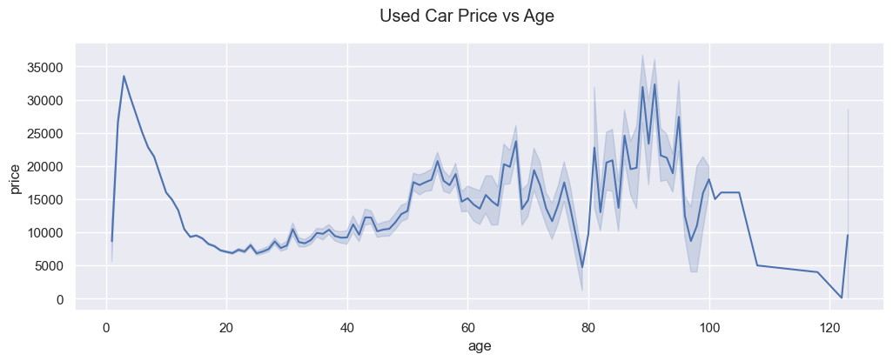
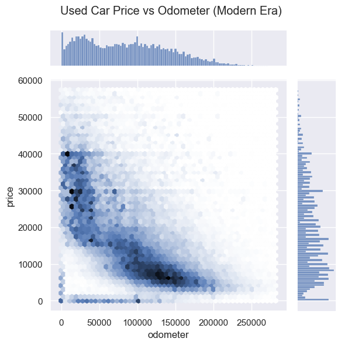
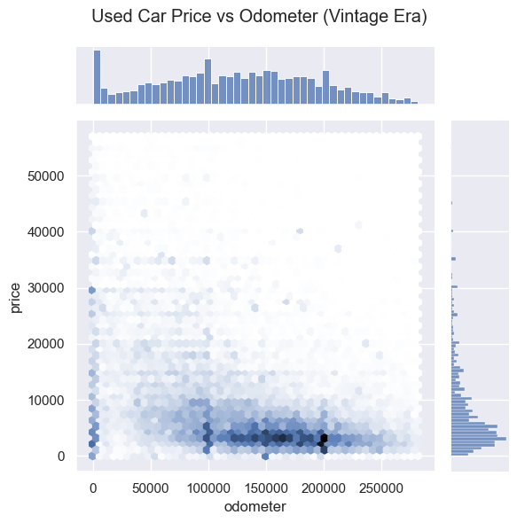
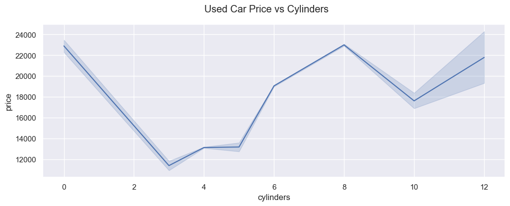

# BH_PCMLAI_11.1

## Assignment 11.1 for Berkeley Haas - Professional Certificate in Machine Learning and Artificial Intelligence

### Notebook
https://github.com/stormrryder/BH_PCMLAI_11.1/blob/main/used_car_price.ipynb

### Findings

*First Finding*

The age of the used car is the most important factor. The age can be classified in two ways:
- Modern Era: A car is considered in the modern era when it is less than 20 years old. In this era, its the price drops sharply as it ages.
- Vintage Era: A car may be considered a classic when it is more than 20 years old. In this era, its price will generally increase as it ages and will possibly reach its peak value at 90 years old.

*Second Finding*

The next most important factor is its odometer. Again, this factor is influenced by which era the car belongs to.
- Modern Era: During this early timeframe, the car's price is negatively impacted by the increase of its mileage.
- Vintage Era: During this later timeframe, the car's price is not affected by its odometer reading.

 Modern                    |   Vintage
:-------------------------:|:-------------------------:
  |  

*Third Finding*

The last important factor is the number of cylinders. This factor is not influenced by a car's era.

Generally, a used car value will increase with the number of cylinders. However, there are some different situations to consider:
- Electric cars do not have cylinders and are newer which inceases the price. Therefore cylinders is not important for this type of car.
- There are two segments of vehicles: passenger vehicles and work trucks. Both will increase price with the increase of cylinders.
  - Passenger vehicles will typically have cylinders between 3 and 8.
  - Work truck between 10 and 12.

### Recommendations
The used car dealership should acquire vehicles that are relatively new with low mileage and powerful engines. Examples of vehicle with large engines would be large SUVs or sports cars.

### Next steps

1. The dataset contains various types of vehicle, it would be better to separate it and build different models.
  - A model for cars that are less than 20 years old vs a model for cars that are over 20 years old
  - A model for electric cars vs a model for gas powered cars
  - A model for personal use vehicle vs a model for heavy work trucks
  - Models for different locations
2. It was noted that the dataset contains some motocycles, those should have been removed from the dataset
3. Since the model feature is very 'dirty', we could use a proper vehicle database to extract the missing feature values instead of using the most common values for the model.
4. Linear regression does not seem to be the ideal model for this dataset which has a lot of categories. Explore other models.
